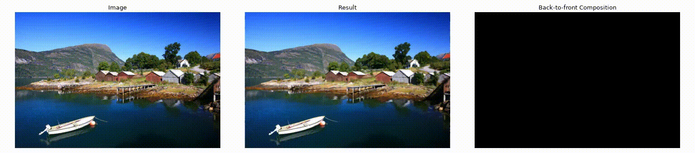

# StrokeGS

StrokeGS is a 2D Gaussian splatting pipeline that reconstructs images by optimizing parametric Bézier curves.


_Reconstruction of image `0808` from the [DIV2K validation set](https://data.vision.ee.ethz.ch/cvl/DIV2K), using 2048 cubic Bézier curves._

## Installation

### System Requirements

- NVIDIA GPU with CUDA support
- [NVIDIA driver](https://www.nvidia.com/en-us/drivers)
- [CUDA Toolkit](https://developer.nvidia.com/cuda-downloads)

### Setup

```bash
git clone https://github.com/hcmok/StrokeGS
cd StrokeGS

uv sync
```

## Usage

```bash
# Run on an input image
uv run python -m src.scripts.run --image "path_to_image"

# Run on the example image
uv run python -m src.scripts.run --image assets/0808.png
```

## References

This project uses image `0808` from the [DIV2K validation set](https://data.vision.ee.ethz.ch/cvl/DIV2K) for evaluation.

```bib
@InProceedings{Agustsson_2017_CVPR_Workshops,
    author = {Agustsson, Eirikur and Timofte, Radu},
	title = {NTIRE 2017 Challenge on Single Image Super-Resolution: Dataset and Study},
	booktitle = {The IEEE Conference on Computer Vision and Pattern Recognition (CVPR) Workshops},
	month = {July},
	year = {2017}
}

@InProceedings{Timofte_2017_CVPR_Workshops,
    author = {Timofte, Radu and Agustsson, Eirikur and Van Gool, Luc and Yang, Ming-Hsuan and Zhang, Lei and Lim, Bee and others},
    title = {NTIRE 2017 Challenge on Single Image Super-Resolution: Methods and Results},
    booktitle = {The IEEE Conference on Computer Vision and Pattern Recognition (CVPR) Workshops},
    month = {July},
    year = {2017}
}
```
